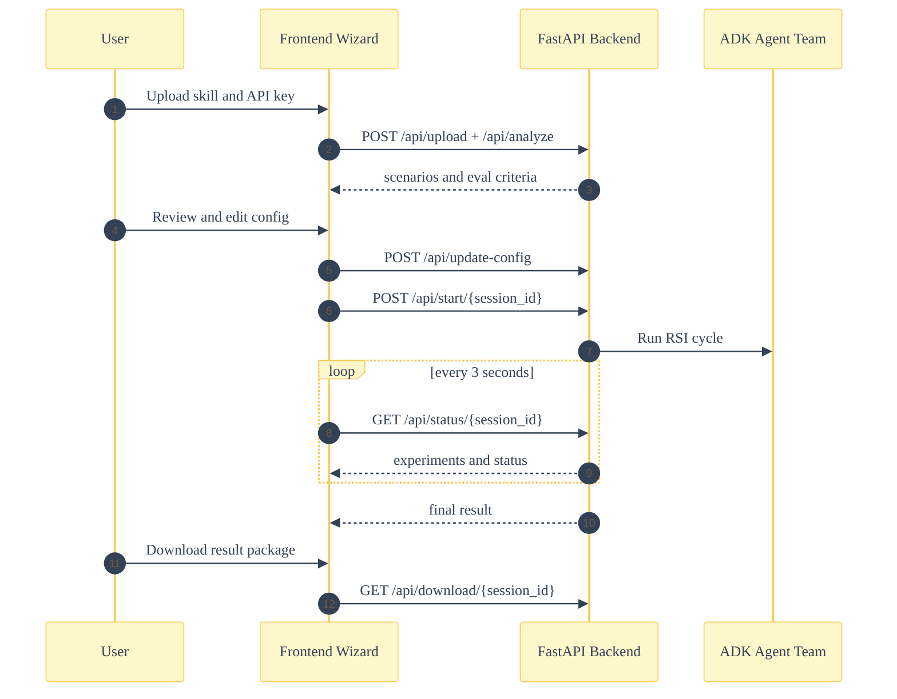
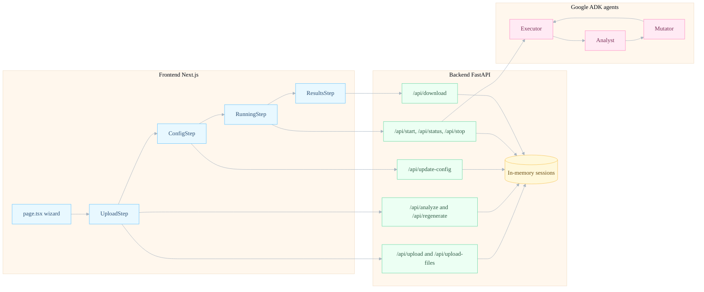
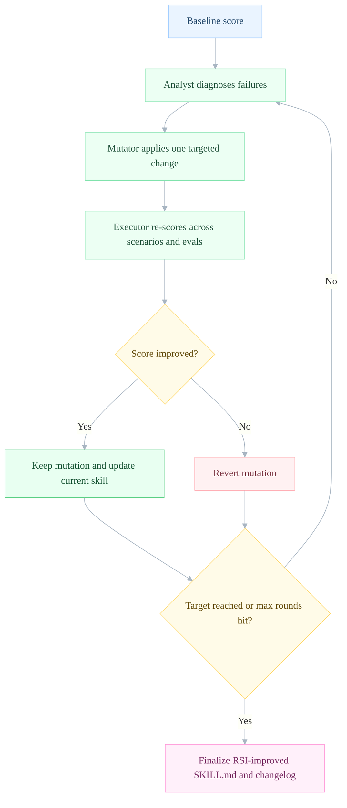

# Recurring Self Improvement (RSI)

Recurring Self Improvement (RSI) continuously upgrades your agent skills using a multi-agent system built with **Google ADK (Agent Development Kit)** and **Gemini**. Upload a skill, let the agents generate test scenarios and evaluation criteria, then run an RSI cycle where three specialized ADK agents collaborate to improve your skill.


## How It Works

This app implements an automated skill improvement loop inspired by Karpathy's autoresearch methodology, powered by a team of ADK agents:

1. **Upload**: Drop in your skill folder (following [agentskills.io](https://agentskills.io) spec)
2. **Configure**: The Executor agent generates test scenarios and evaluation criteria. Edit, add, or regenerate as needed
3. **RSI Cycle**: Three ADK agents collaborate - one executes and scores, one diagnoses failures, one applies fixes
4. **Results**: Download your RSI-improved skill with a detailed changelog



### The ADK Agent Team

| Agent | Role | What It Does |
| ----- | ---- | ------------ |
| **Executor** | Skill Runner & Scorer | Executes the skill against test scenarios, scores outputs against evaluation criteria, and generates initial test scenarios during analysis |
| **Analyst** | Failure Diagnostician | Examines failed evaluations, identifies root causes, and recommends a mutation strategy. Uses Pydantic `output_schema` for guaranteed structured JSON |
| **Mutator** | Prompt Editor | Makes exactly ONE targeted change to the skill prompt based on the analyst's diagnosis. Uses Pydantic `output_schema` for guaranteed structured JSON |

### The RSI Cycle

- The **Executor** agent runs the skill against all test scenarios
- The **Executor** then scores each output against binary yes/no evaluation criteria
- The **Analyst** agent diagnoses failure patterns and picks a strategy (`add_example`, `add_constraint`, `restructure`, or `add_edge_case`)
- The **Mutator** agent applies ONE surgical fix to the skill prompt
- The **Executor** re-runs and re-scores the modified skill
- Changes are kept if the score improves, reverted if not
- Repeats until the target pass rate is reached or max rounds hit

## Architecture

```text
recurring-self-improvement-rsi/
├── backend/                 # FastAPI server + ADK RSI cycle engine
│   ├── app.py              # REST API endpoints + SSE streaming
│   ├── adk_optimizer.py    # Multi-agent optimizer (Executor, Analyst, Mutator)
│   └── requirements.txt
├── frontend/               # Next.js + React + Tailwind
│   ├── src/
│   │   ├── app/            # Main page + layout
│   │   └── components/     # Upload, Config, Running, Results steps
│   ├── package.json
│   └── *.config.ts
├── example_skills/         # Sample skills to test
│   ├── code-reviewer/
│   └── content-writer/
└── README.md
```



## Tech Stack

- **Backend**: Python 3.10+, FastAPI, Google ADK, Pydantic
- **Frontend**: Next.js 15, React 19, Tailwind CSS v4, Recharts
- **AI**: Google ADK multi-agent system with Gemini (`gemini-3-flash-preview`) — structured output via `output_schema` on Analyst and Mutator agents
- **Real-time**: Server-Sent Events (SSE) for live RSI cycle progress

## Quick Start

### Backend Setup

```bash
cd backend

# Create virtual environment
python -m venv venv
source venv/bin/activate  # On Windows: venv\Scripts\activate

# Install dependencies
pip install -r requirements.txt

# Set up environment (optional — the app will prompt for your API key in the UI)
cp .env.example .env
# Edit .env and add your GOOGLE_API_KEY

# Run server
python app.py
# Server runs on http://localhost:8891
```

### Frontend Setup

```bash
cd frontend

# Install dependencies
npm install

# Run development server
npm run dev
# App runs on http://localhost:3000
```

### Usage

1. Get a Gemini API key from [Google AI Studio](https://aistudio.google.com/apikey)
2. Open [http://localhost:3000](http://localhost:3000)
3. Upload a skill folder as a .zip file (or try an example)
4. Enter your Gemini API key
5. Review and edit the generated test scenarios and evaluation criteria
6. Click "Start RSI Cycle" and watch the agents collaborate to improve your skill
7. Download your RSI-improved skill when complete

## Skill Format

Skills follow the [agentskills.io](https://agentskills.io) specification:

```text
my-skill/
├── SKILL.md           # Required: YAML frontmatter + instructions
├── scripts/           # Optional: executable code
├── references/        # Optional: additional docs
└── assets/            # Optional: templates, resources
```

Example SKILL.md:

```markdown
---
name: my-skill
description: What this skill does and when to use it
license: MIT
metadata:
  author: your-name
  version: "1.0"
---

# My Skill

Your skill instructions here...
```

## Example Skills

Two example skills are included:

- **code-reviewer**: Reviews code for security, performance, and best practices
- **content-writer**: Writes marketing copy following style guidelines

Create a zip file from an example:

```bash
cd example_skills
zip -r code-reviewer.zip code-reviewer/
```

Then upload the zip in the app.

## How the Multi-Agent RSI Cycle Works

### 1. Analysis Phase

The **Executor** agent analyzes your skill and generates:

- 3-4 diverse test scenarios
- 4-6 binary evaluation criteria (yes/no questions)

You can edit, add, or remove scenarios and criteria before the RSI cycle begins.

### 2. Baseline Run

The **Executor** agent runs the skill against all scenarios and scores each output against all evaluation criteria. This establishes the starting score.

### 3. RSI Decision Loop



For each round, the three agents collaborate:

1. **Executor** runs the skill against all test scenarios and scores the outputs
2. **Analyst** examines failures, identifies root cause, and selects a mutation strategy (returns structured JSON via `output_schema`)
3. **Mutator** applies ONE specific change to improve the skill in the current round (returns structured JSON via `output_schema`)
4. **Executor** re-runs and re-scores the modified skill
5. Score is compared - keep the change if improved, revert if not
6. Repeat until target pass rate or max rounds reached

### 4. Output

- RSI-improved SKILL.md with all successful changes applied
- Detailed changelog of what changed and why
- Performance comparison (baseline vs final)

## API Endpoints

| Method | Endpoint | Description |
| ------ | -------- | ----------- |
| `POST` | `/api/upload` | Upload skill zip file (max 10MB, text files only) |
| `POST` | `/api/upload-files` | Upload multiple files (folder upload) |
| `POST` | `/api/analyze` | Generate scenarios and evals (requires Gemini API key) |
| `POST` | `/api/regenerate` | Regenerate scenarios and evals |
| `POST` | `/api/update-config` | Save user's selected/edited config |
| `POST` | `/api/start/{session_id}` | Start RSI cycle |
| `GET` | `/api/stream/{session_id}` | SSE stream of RSI cycle progress |
| `POST` | `/api/stop/{session_id}` | Stop RSI cycle |
| `GET` | `/api/download/{session_id}` | Download RSI-improved skill |
| `GET` | `/api/examples` | List available example skills |
| `POST` | `/api/examples/{name}/load` | Load an example skill |
| `GET` | `/api/status/{session_id}` | Poll-based status endpoint |
| `GET` | `/health` | Health check |

## Configuration

### Backend

The Gemini API key is passed from the frontend with each request. Optionally set `GOOGLE_API_KEY` in `.env` for local development. Server runs on port **8891**.

Upload limits:

- **10MB** max total upload size
- **1MB** max per file
- **50** max files per upload
- Text files only (`.md`, `.txt`, `.json`, `.yaml`, `.py`, `.js`, `.ts`, etc.)

Sessions expire after **1 hour** automatically.

### Frontend

API key is entered in the UI, stored in component state (not persisted), and sent with each request. The key is passed to the backend which sets `GOOGLE_API_KEY` for ADK agent authentication.

### RSI Cycle Parameters

In `RunningStep.tsx`, adjust `max_rounds` (capped at 50):

```typescript
body: JSON.stringify({
  max_rounds: 20,  // Default: 20, max: 50
}),
```

In `adk_optimizer.py`, adjust the model:

```python
def __init__(self, api_key: str, model: str = "gemini-3-flash-preview"):
```

## Development

### Backend Tests

```bash
cd backend
python -c "from adk_optimizer import SkillOptimizer; print('OK')"
```

### Frontend Build

```bash
cd frontend
npm run build
```

### Live Development

Both servers support hot reload. Edit code and see changes immediately.

## Based on Karpathy's Autoresearch

This tool applies Andrej Karpathy's autoresearch methodology (using LLMs to iteratively improve their own prompts) to agent skills. The key insight: rather than manually tweaking prompts, define success criteria and let the AI run recurring self improvement on itself - now powered by a team of specialized ADK agents.

Original concept: [https://github.com/karpathy/autoresearch](https://github.com/karpathy/autoresearch)
